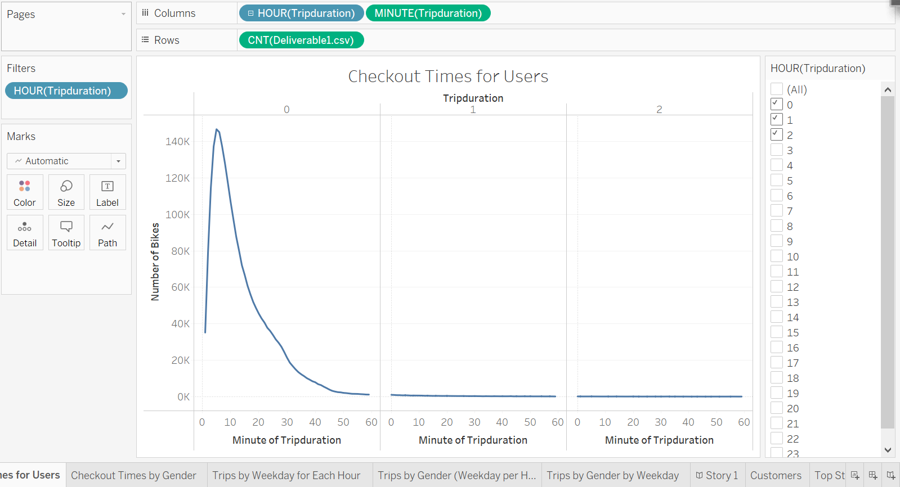

# Bikesharing

## Overview of the analysis: 
In this project, I will create a Tableau story aimed to convince investors that bike-sharing program in Des Moines is a sound business model proposal. In doing so, I will utilize a dataset related to bike trips with details on bikes, bike-riders, and the other trip-related information and conduct a bike trip analysis to support the proposal. As part of my analysis, first I will use Pandas to make changes to a column's (in the data set) datatype and create an updated data set. Next, I will complete several visualizations within Tableau to develop a story that explains how the available data backs the business proposal.

## Results: 

###

## Summary: 

Provide a high-level summary of the results and two additional visualizations that you would perform with the given dataset.
