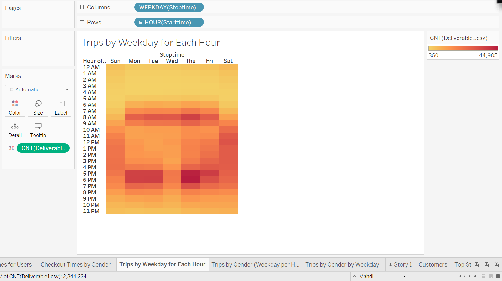

# Bikesharing

## Overview of the analysis: 
In this project, I will create a Tableau story aimed to convince investors that bike-sharing program in Des Moines is a sound business model proposal. In doing so, I will utilize a dataset related to bike trips with details on bikes, bike-riders, and the other trip-related information and conduct a bike trip analysis to support the proposal. As part of my analysis, first I will use Pandas to make changes to a column's (in the data set) datatype and create an updated data set. Next, I will complete several visualizations within Tableau to develop a story that explains how the available data backs the business proposal.

## Results: 

### Link to Tableau Public:

https://public.tableau.com/views/ChallengeAssignment_16704584045550/CheckoutTimesforUsers?:language=en-US&:display_count=n&:origin=viz_share_link

### Checkout Times for Users:

The chart shows that the majority of bike rides lasted for less than hour where the highest number of rides being for 5 minutes.

 

### Checkout Times by Gender:

According to this viz, males comprise the biggest share of rides occured in August. However, the bike riding pattern remains the same across genders, with range of 0 to 10 minutes as the most common riding time.

 

### Trips by Weekday for Each Hour:

Based on the heatmatmap, bike riders use biksharing more often at 7 to 9 am in the morning and 5 to 7 pm in the evening during business days. Whereas, bikesharing use pattern is evenly distributed over the daytime (from 9 am to 6 pm) on the weekends.

 

### Trips by Gender (Weekday per Hour):

Comparing genders in terms of how females vs male vs unknown use bikesharing over the week, we can see that males and female almost follow a same use behavior per weekday and hour, although number of males using this service is much more the others. However, in the unknown group, it looks like that they mostly used bikesharing on weekeneds rather than during business days.

.png)

### Trips by Gender by Weekday:

The viz below shows that majority of bikesharing users are male subscribers who mainly use bikesharing during almost all weekdays, with highest frequency on Thursdays. However, unsubscribers use bikesharing more often on weekends.

### Customers:

Majority of Bikesharing use is attributed to subscribers (1,900,359 rides). The remaining 443,865 rides attributed to non-subscribers who use bikesharing for liesure or limited purposes.

## Summary: 

Provide a high-level summary of the results and two additional visualizations that you would perform with the given dataset.
